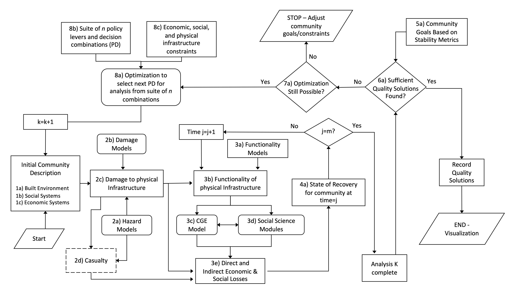

# Galveston Notebook Gallery
This Jupyter book contains a collection of notebooks demonstrating the use of IN-CORE in the Galveston Island, Texas, testbed. The notebooks explore different elements of the IN-CORE flowchart, with certain notebooks dedicated to individual components and others encompassing several sections of the flowchart. Each notebook is the contribution of various authors, who are credited at the start of their respective notebook.



## Galveston Island

Galveston Island, located in Texas, serves as a practical example to apply the methods outlined in the preceding segment. This coastal city is home to over 53,000 people, comprising around 22,000 families. The selection of Galveston for this study is strategic given its vulnerability to hurricanes, owing to its position in the Gulf of Mexico, a region frequently hit by such storms. The island has been the site of significant hurricane disasters, including hurricanes Ike and Harvey, which, in 2008 and 2017, led to debris removal costs amounting to 752 and 345 million dollars respectively. These events underscore Galveston's suitability as a model location for examining the effects of debris on coastal communities. Research has consistently underscored Galveston Island's high risk in the face of hurricane threats, with studies ranging from analyses of the resilience of coastal roadways against storm hazards to probabilistic assessments of hurricane risks to the island's intertwined physical and social infrastructures. An illustration captures the geographic positioning of Galveston Island within the Gulf of Mexico.


## Table of Content
```{tableofcontents}
```

## Funding
This work was supported in part by the National Institute of Standards and Technology (NIST), under the award numbers 70NANB15H044 and 70NANB20H008, through a collaborative effort with Colorado State University. The contributions advance the model integration efforts spearheaded by the Center, particularly within the Galveston Testbed initiative.


